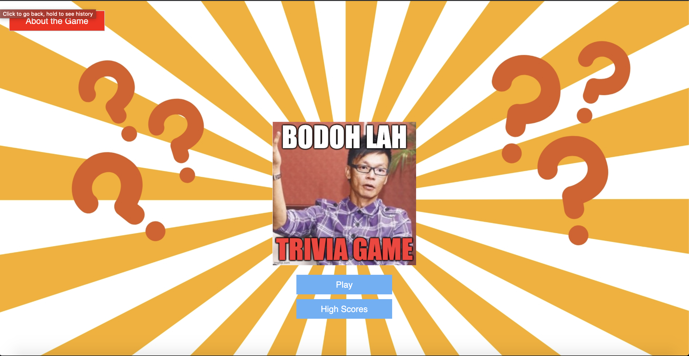
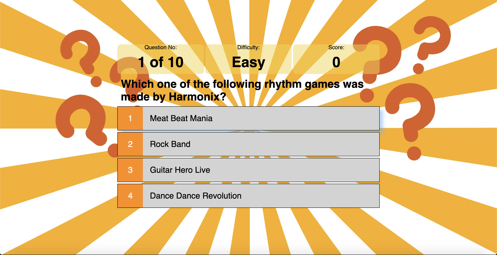
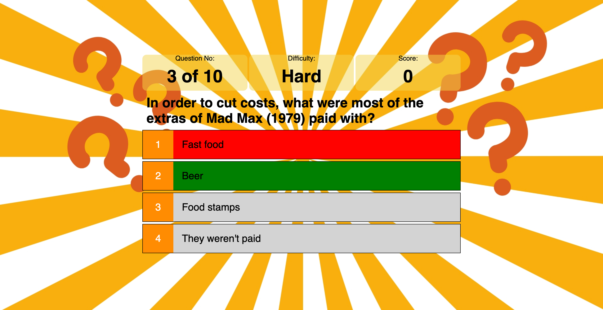
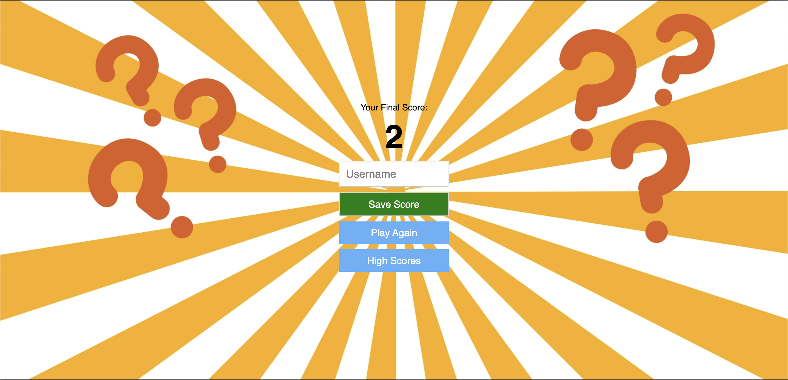

# _Bodoh Lah!_ Trivia Game App #

## Overview
The _Bodoh Lah!_ Trivia Game App will allow players to answer Trivia questions, earn points and save their high scores.

There are different difficulty levels to the game - Easy, Medium, Hard and Random - and players can choose which level they would like to play the game.

This Trivia Game App utilizes the Open Trivia DB API to obtain Trivia Questions.

## Technologies
* HTML5
* CSS
* JavaScript
* JQuery

## APIs Used
The [Open Trivia DB API](https://opentdb.com/) was used for this app.

## Project Demo
_Bodoh Lah!_ Trivia Game App is available to try via this link: http://ryanjho.github.io/trivia-app/

## User Stories and Wireframes
### 1. Home Page ###
As a player, I want to access the Home Page and start playing the game.

### 2. Choose Difficulty Level ###
As a player, I want to choose the difficulty level of the game before starting.

### 3. Play Game ###
As a player, I want to start playing the game and click to select my answer to the question.

### 4. Highlight Correct Answer If Wrong Answer Selected ###
As a player, I would like to know the correct answer to the question if I have selected the wrong answer.

### 5. Result Page ##
As a player, I would like to check out my final score after the game is played. I would also like to save my score with my username.

## Additional Features To Add With More Time ##
* Sign in Feature
* Countdown Timer
* Pop-up GIPHY for every wrong answer selected
* Additional CSS Styling